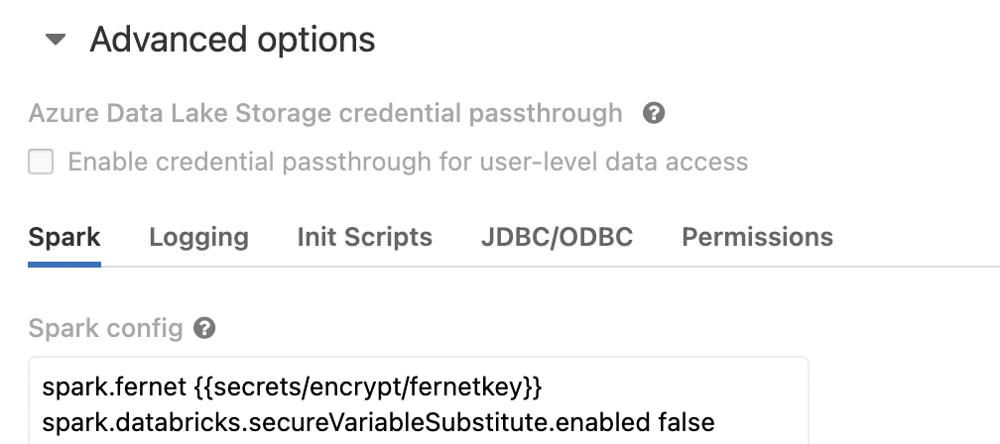

# Data Encryption for PII compliance

## Resources
- https://www.databricks.com/blog/2020/11/20/enforcing-column-level-encryption-and-avoiding-data-duplication-with-pii.html
- https://docs.databricks.com/security/access-control/table-acls/object-privileges.html
- https://www.databricks.com/notebooks/enforcing-column-level-encryption.html

## Install Fernet Decrypt as permanent Hive UDF

### Make scala jar package
* Requirements: Java 8, Scala 2, SBT installed
```sh

Compile the project, assembling to have all dependencies

$ cd scala-fernet-udf
$ sbt compile
$ sbt assembly
```

### Install the jar package into Databricks cluster(s)

Upload and install the Jar file into Databricks cluster.


## Create Fernet key and store in Databricks secrets

* Requirements: Python, pip, Databricks cli installed

### Install Fernet lib for python
```
pip install fernet
```

### Create Fernet key with python console

```python
>>> from cryptography.fernet import Fernet
>>> key = Fernet.generate_key() 
```
Copy the key and save it in databricks secrets with databricks cli
```sh
$ databricks secrets create-scope --scope encrypt
$ databricks secrets put --scope encrypt --key fernetkey
```

### Set Spark-Config for the Databricks cluster to access the secrets

Set Spark config key **spark.fernet** to point to the secret in the created scope



## Create dynamic view with decryption UDF

### Register permanent Hive UDF with installed Jar

```sql
%sql create function udfPIIDecrypt as 'com.nm.udf.DecryptUdf' using jar 'dbfs:/FileStore/jars/a236f17f_f7c0_4b65_92cc_1122edc146b2-decryptUDF_assembly_1_0-04470.jar'
```

### Create dynamic view with decryption
```sql
%sql create view  Test_Encryption_PII as select name, address, udfPIIDecrypt(ssn, "${spark.fernet}") as ssn from Test_Encryption_Table
```