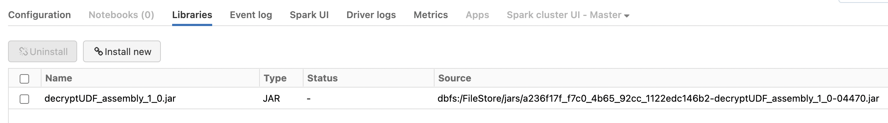

# Data Encryption for PII compliance

## Resources
- https://www.databricks.com/blog/2020/11/20/enforcing-column-level-encryption-and-avoiding-data-duplication-with-pii.html
- https://docs.databricks.com/security/access-control/table-acls/object-privileges.html
- https://www.databricks.com/notebooks/enforcing-column-level-encryption.html

## Install Fernet Decrypt as permanent Hive UDF

### Make scala jar package
* Requirements: Java 8, Scala 2, SBT installed
```sh

Compile the project, assembling to have all dependencies

$ cd scala-fernet-udf
$ sbt compile
$ sbt assembly
```

### Install the jar package into Databricks cluster(s)

Upload and install the Jar file into Databricks cluster.

